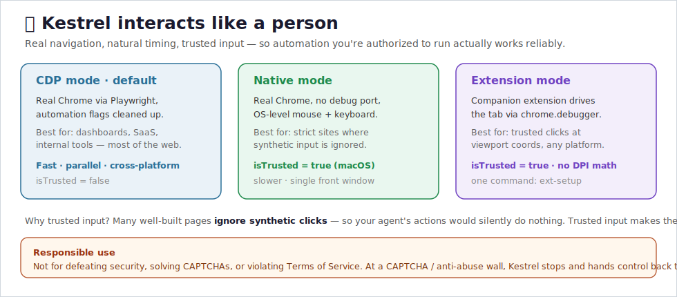

# Reliability: trusted input & correctness

Tsaagan acts on the web the way a person would — real navigation, real clicks and
keystrokes. The point is **reliability for automation you're authorized to run** (your
own accounts, your team's dashboards, sites whose terms permit it).

> **Responsible use, up front.** Tsaagan is a productivity tool. It is **not** for
> defeating security, solving CAPTCHAs, evading bans, scraping at abusive volume, or
> anything that violates a site's Terms of Service. When Tsaagan hits a CAPTCHA or an
> anti-abuse wall, it **stops and hands control back to you** — by design (see
> `AGENTS.md`). Use it only where you're permitted to automate.

## Why there's more than one input mode — it's about correctness

A DOM event carries an `isTrusted` flag that is `true` only for genuine user input.
A lot of well-built sites deliberately ignore *synthetic* clicks and keystrokes for
their own integrity. If your agent's input is synthetic, those actions **silently do
nothing** — the form never submits, the button never fires. So Tsaagan offers input
paths that produce `isTrusted=true` events, so your authorized actions actually take
effect. That's the whole reason for the extra modes — correctness, not concealment.

### CDP mode (default) — for the vast majority of the web
Playwright driving the real Chrome binary. Fast, parallel, cross-platform, and plenty
for dashboards, SaaS, and internal tools. Input here is `isTrusted=false`, so the rare
strict site ignores it — use one of the modes below for those.

### Native mode — `mode=native` (macOS)
Drives your real Chrome with no debug port. Perception via AppleScript; input via real
OS-level mouse/keyboard (`cliclick`) → `isTrusted=true`. Slower, single front window,
coordinate/vision grounding.

### Extension mode — `ext-setup` (any OS)
A companion Chrome extension delivers `isTrusted=true` events at **viewport
coordinates** via `chrome.debugger` (no screen/DPI math), in your real Chrome. The
cleanest trusted-input path. See [EXTENSION.md](EXTENSION.md).

## Honest limits

The hardest sites (large search/AI platforms) also score **behavior and account risk**,
and some block automation outright. Tsaagan does not try to get past that, and you
shouldn't either — automating a site that forbids it can violate its Terms of Service
and put your account at risk. Stay within each site's terms, only automate accounts
you're permitted to, and when Tsaagan meets a CAPTCHA or anti-abuse wall, let it do
what it's built to do: **stop and hand off to a human.**
